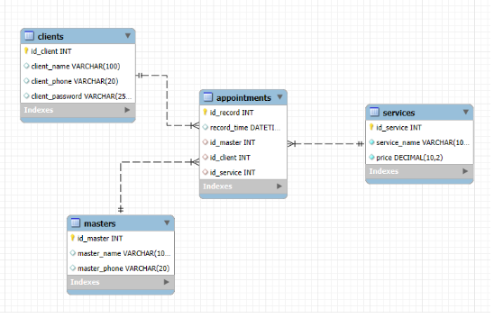

# BeautySalon - Система онлайн-запису

Веб-додаток для автоматизації роботи салону краси. Дозволяє клієнтам записуватися на послуги онлайн, а адміністрації — вести автоматичний облік.

## ER-діаграма структури бази даних

## Структура бази даних 

База даних проєкту `beautysalon` побудована на реляційній моделі та складається з чотирьох нормалізованих таблиць. Схема забезпечує цілісність даних та оптимізована для швидкого пошуку записів.

### Опис таблиць 

1. **`Clients` (Клієнти)**
   - Зберігає інформацію про зареєстрованих користувачів.
   - **Ключові поля:**
     - `id_client` (`INT`, **PK**): Унікальний ідентифікатор клієнта.
     - `client_name` (`VARCHAR`): ПІБ користувача.
     - `client_phone` (`VARCHAR`): Номер телефону (використовується як логін).
     - `client_password` (`VARCHAR`): Хеш пароля для безпечної авторизації.

2. **`Masters` (Майстри)**
   - Довідник персоналу салону.
   - **Ключові поля:**
     - `id_master` (`INT`, **PK**): Унікальний ідентифікатор майстра.
     - `master_name` (`VARCHAR`): Ім'я майстра.
     - `master_phone` (`VARCHAR`): Контактний телефон майстра.

3. **`Services` (Послуги)**
   - Довідник доступних послуг та їх вартості.
   - **Ключові поля:**
     - `id_service` (`INT`, **PK**): Унікальний ідентифікатор послуги.
     - `service_name` (`VARCHAR`): Назва процедури.
     - `price` (`DECIMAL 10,2`): Вартість послуги.

4. **`Appointments` (Записи)**
   - Центральна таблиця, що фіксує факт бронювання візиту.
   - **Ключові поля:**
     - `id_record` (`INT`, **PK**): Унікальний номер запису.
     - `record_time` (`DATETIME`): Дата та час візиту.
     - `id_client` (`INT`, **FK**): Зовнішній ключ, посилання на таблицю `clients`.
     - `id_master` (`INT`, **FK**): Зовнішній ключ, посилання на таблицю `masters`.
     - `id_service` (`INT`, **FK**): Зовнішній ключ, посилання на таблицю `services`.

### Зв'язки (Relationships)

Система використовує зв'язки типу **"Один-до-багатьох" (1:N)**:

- **Clients ➔ Appointments:** Один клієнт може мати багато записів.
- **Masters ➔ Appointments:** Один майстер може обслуговувати багато записів.
- **Services ➔ Appointments:** Одна послуга може фігурувати у багатьох записах.

Цілісність даних забезпечується зовнішніми ключами (**Foreign Keys**), що унеможливлює створення запису для неіснуючого клієнта, майстра або послуги.

## Технології
* **Backend:** PHP 8.x
* **Database:** MySQL 
* **Frontend:** HTML5, CSS3
* **Server:** Apache 

## Інструкція з розгортання 

### Крок 1. Підготовка середовища
1. Встановіть локальний сервер **XAMPP** (або OpenServer).
2. Запустіть модулі **Apache** та **MySQL** у панелі керування.

### Крок 2. Налаштування бази даних
1. Відкрийте phpMyAdmin (`http://localhost/phpmyadmin`).
2. Створіть нову базу даних з назвою `beautysalon`.
3. Імпортуйте файл `database.sql` (знаходиться в папці `db` проєкту) або виконайте SQL-запит для створення таблиць.

### Крок 3. Налаштування проєкту
1. Скопіюйте папку з проєктом у директорію сервера:
   - Для XAMPP: `C:\xampp\htdocs\beautysalon`
2. Перевірте файл `connect.php`. Налаштування мають бути наступними:
   ```php
   $servername = "localhost";
   $username = "root";
   $password = "";
   $dbname = "beautysalon";
